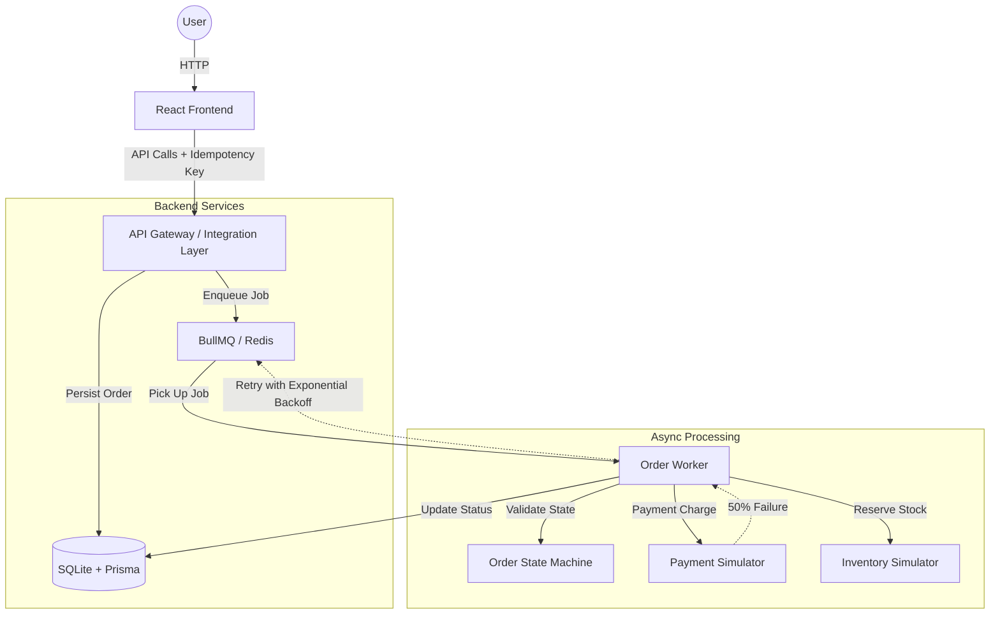

# 🚀 Failure-First: Resilient Order Processing System

[](https://www.typescriptlang.org/)
[](https://nodejs.org/)
[](https://reactjs.org/)
[](https://redis.io/)
[](https://www.prisma.io/)

A production-ready demonstration of **Distributed System Resiliency** and **Failure-First Design**. This project showcases how to build a robust e-commerce order flow that remains stable even when downstream services (payment, inventory) are unstable.

---

## 💡 Why "Failure-First"?

In distributed systems, **failure is the norm, not the exception**. Latency, network partitions, and 500 errors are inevitable. 

Most systems are built for the "happy path" and break under pressure. **Failure-First** reverses this: it assumes every external call will fail and builds the architecture around graceful recovery, retries, and consistency.

## 🛠️ System Design Concepts Implemented

### 1. Robust State Machine
Uses a strict **State Machine** (XState-inspired) to govern order transitions. This prevents "illegal" states (e.g., an order moving from `CANCELLED` to `COMPLETED`) and ensures data integrity across asynchronous steps.

### 2. Idempotency Layer
Implements an **Idempotency Middleware** using unique keys. This allows the system to safely retry requests without side effects, preventing double-charging or duplicate inventory deductions—a critical requirement for fintech and e-commerce.

### 3. Distributed Task Queues
Powered by **BullMQ and Redis**, order processing is decoupled from the API. This enables:
- **Async Execution**: Immediate response to the user while work happens in the background.
- **Exponential Backoff**: Automatic retries that wait longer after each failure to avoid "hammering" a struggling service.
- **Dead Letter Queues**: Isolation of permanently failed jobs for manual inspection.

### 4. Optimistic Locking
Uses a `version` field in the database to handle concurrent updates. This prevents "lost updates" if two processes try to modify the same order simultaneously.

### 5. Chaos Simulation
The system includes built-in "Chaos" (Simulators) with configurable failure rates:
- **50% Payment Failure Rate**: To demonstrate automatic recovery.
- **10% Inventory Bottlenecks**: To show compensating transactions (cancellations).

---

## 🏗️ Architectural Design

The system follows a decoupled, event-driven architecture designed for high availability and fault tolerance.



### The "Gateway" Pattern
In this project, the Express backend serves as a **Smart Integration Layer** (conceptually an API Gateway). It handles:
- **Request Orchestration**: Coordinating initial order creation across multiple data models.
- **Idempotency Enforcement**: Detecting and filtering duplicate requests at the perimeter before they hit downstream services.
- **Rate Limiting & Validation**: Ensuring only valid, well-formed requests enter the processing pipeline.
- **Unified Entry Point**: Providing a single, secure interface for the frontend while abstracting the complexity of Redis, SQLite, and internal workers.

---

## 🏗️ The Tech Stack

| Layer | Technology |
| :--- | :--- |
| **Frontend** | React 18, Vite, Tailwind CSS, Lucide Icons |
| **Backend** | Node.js, Express, TypeScript |
| **Database** | SQLite + Prisma ORM |
| **Asynchronous Work** | BullMQ + Redis |
| **Infrastructure** | Docker Compose (for Redis) |

---

## 🚀 What to See (Demo Flow)

1.  **Place an Order**: Hit the Marketplace in the UI.
2.  **Watch the Chaos**: The Resiliency Dashboard shows real-time state transitions.
3.  **Automatic Recovery**: Observe orders moving to `PAYMENT_FAILED` and then automatically retrying until they hit `PAYMENT_SUCCESS`.
4.  **Terminal States**: See how the system handles terminal failures by moving orders to `CANCELLED` after exhausting retries or stock.

---

## 🔧 Getting Started

### Prerequisites
- Node.js (v18+)
- Docker (for Redis)

### Installation
1.  **Clone the repo**:
    ```bash
    git clone https://github.com/bhawansh1/Failure-First-SystemDesign.git
    cd Failure-First-SystemDesign
    ```

2.  **Setup Infrastructure**:
    ```bash
    docker-compose up -d
    ```

3.  **Install & Start Backend**:
    ```bash
    cd backend
    npm install
    npx prisma generate
    npx prisma db push
    npm run dev
    ```

4.  **Install & Start Frontend**:
    ```bash
    cd ../frontend
    npm install
    npm run dev
    ```

---

## 👨‍💻 Author
**Bhawansh Singh**

*Built to demonstrate engineering excellence in distributed systems.*
